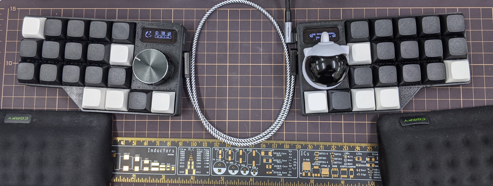

# The Space Between You and Me

**The Space Between You and Me** is a split ortholinear 3x5 keyboard with 4
thumb keys, a trackball, and a rotary encoder.

## Build Guide

Check the build guide [here (English)](./build_guide_en.md), if you are
assembling your keyboard from scratch.

## Firmware Guide

Check the firmware guide [here (English)](./firmware_guide_en.md), if you want
to customize your keyboard.

## Schematic

Check the schematic [here](./sch/tsbym/).

## 3D Printed Case

Download the files [here](https://www.printables.com/model/987788-tsbym-case).
