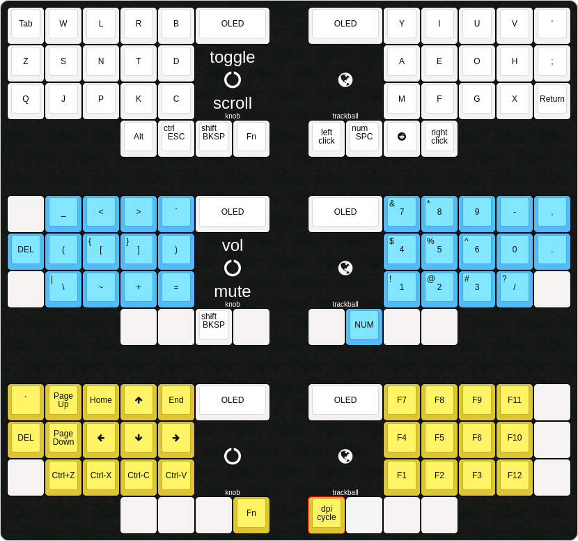

# The Space Between You and Me - Firmware Guide

Thank you for deciding to build your own **The Space Between You and Me**
keyboard! This keyboard uses a reversible PCB design and can be configured to
add a trackball and/or a rotary encoder to each side. Below you will find a
detailed programming guide with the initial setup, as well as more advanced
configurations.

- If you came from the [BUILD GUIDE](./build_guide_en.md), then jump to [Initial
Setup](#section-is).
- If you want to customize your keyboard, then go to [My Custom
    Keyboard](#section-mck).

## <a name="section-is"></a>Initial Setup

**The Space Between You and Me** is a split keyboard that uses
[QMK](https://docs.qmk.fm/#/) as its firmware.  It takes advantage of the
`EE_HANDS` options to setup the left and right side of the keyboard. If you
have used QMK before, feel free to program the device using other options.
Otherwise, the defaults presented in this guide should be enough to get you a
working keyboard.

### Installing QMK

While I could explain how to install QMK in your computer, the developers of
QMK have already made an [excellent guide](https://docs.qmk.fm/#/newbs) on its
installation process. We need to use the [Advanced
Version](https://docs.qmk.fm/#/newbs) of QMK to access more powerful features
like knobs and trackballs. This means, we are going to use the terminal to
program the keyboard.

`HAVE AN EXTRA KEYBOARD AT HAND` when programming **The Space Between You and
Me** because it is quite easy to misconfigure the keyboard during the setup
process.

### Right side

Let's start with the right side of the keyboard. Run this line of code on the
terminal:

```
$ qmk compile -j 0 -kb cgxkb/tsbym -km default:dfu-split-right
```

QMK will wait for the `RIGHT SIDE` of the keyboard to be connected. Use an
USB-C cable to connect the `Elite-C` to your computer. QMK should start
programming the device. If nothing happens, then it is possible that you need
to press the `RESET` button.

If you have an `OLED Display` connected on that side, you will see a message
appear on the keyboard. This means that the keyboard was successfully
programmed!

### Left side

We are going to do something similar for the `LEFT SIDE`. Run this line of code
on the terminal (it is different from the right side!):

```
$ qmk compile -j 0 -kb cgxkb/tsbym -km default:dfu-split-left
```

If you have an `OLED Display` connected on that side, you will see a message
appear on the keyboard. This means that the keyboard was successfully
programmed!

### Finished!

If you came from the [BUILD GUIDE](./build_guide_en.md), now it's time to go
back and continue the assembly process! Once you finish, come back here to
install the appropriate layout!

## <a name="section-mck"></a>My Custom Keyboard

The default layout of **The Space Between You and Me** is the [CGx
Layout](#section-cgxl) (you can check more info
[here](https://eiji.onchi.me/project/cgx-keyboard/)). This layout is optimized
for English text and especially made for small hands. If you feel uncomfortable
using QWERTY, give this layout a try!

I'm including other common layout options like:
- [QWERTY](#section-ql)
- [DVORAK](#section-dl)
- [Colemak](#section-cl)

If you are using your own layout, or want to customize the function of each
key/layer, then check:
- [Advanced Customization](#section-ac).

The following layouts assume that you have a `trackball` on the `RIGHT SIDE`
and a `knob` on the `LEFT SIDE`. Because of the size of the memory of the
`atmega32u4 (Elite-C)` and the pins shared by the `trackball` and the `knob`,
we need to change the `rules.mk` file per side.

Also, if one side has a `trackball` and the other side has a `knob`, then the
USB-C cable (master side) should be the same side as the `trackball`.

### <a name="section-cgxl"></a>CGx Layout



To install this layout, program the `RIGHT SIDE` like this:

- Set `POINTING_DEVICE_ENABLE = yes` in `rules.mk`, then run:

```
$ qmk flash -j 0 -kb cgxkb/tsbym -km default
```

Then, program the `LEFT SIDE` like this:

- Set `POINTING_DEVICE_ENABLE = no` in `rules.mk`, then run:

```
$ qmk flash -j 0 -kb cgxkb/tsbym -km default
```


### <a name="section-ql"></a>QWERTY Layout

To install this layout, program the `RIGHT SIDE` like this:

- Set `POINTING_DEVICE_ENABLE = yes` in `rules.mk`, then run:

```
$ qmk flash -j 0 -kb cgxkb/tsbym -km qwerty
```

Then, program the `LEFT SIDE` like this:

- Set `POINTING_DEVICE_ENABLE = no` in `rules.mk`, then run:

```
$ qmk flash -j 0 -kb cgxkb/tsbym -km qwerty
```

### <a name="section-dl"></a>DVORAK Layout

To install this layout, program the `RIGHT SIDE` like this:

- Set `POINTING_DEVICE_ENABLE = yes` in `rules.mk`, then run:

```
$ qmk flash -j 0 -kb cgxkb/tsbym -km dvorak
```

Then, program the `LEFT SIDE` like this:

- Set `POINTING_DEVICE_ENABLE = no` in `rules.mk`, then run:

```
$ qmk flash -j 0 -kb cgxkb/tsbym -km werty
```

### <a name="section-cl"></a>Colemak Layout

To install this layout, program the `RIGHT SIDE` like this:

- Set `POINTING_DEVICE_ENABLE = yes` in `rules.mk`, then run:

```
$ qmk flash -j 0 -kb cgxkb/tsbym -km colemak
```

Then, program the `LEFT SIDE` like this:

- Set `POINTING_DEVICE_ENABLE = no` in `rules.mk`, then run:

```
$ qmk flash -j 0 -kb cgxkb/tsbym -km colemak
```

## <a name="section-ac"></a>Advanced Customization

For advanced customization, I will assume that you have read the [documentation
of QMK](https://docs.qmk.fm/#/). Therefore, I will only list useful settings
and variables that will help you customize **The Space Between You and Me** to
its maximum potential.

### Encoders and SPI

The `knob` and `trackball` share the same pins (`B2 (MOSI)`, `B3 (MISO)`) to
connect the encoder and to use SPI communication. Depending on your keyboard
configuration, set the following definitions on your `config.h`:


- `LEFT KNOB` with `RIGHT TRACKBALL`
```
#define ENCODERS_PAD_A { B2 }
#define ENCODERS_PAD_B { B3 }
#define ENCODERS_PAD_A_RIGHT { D3 }
#define ENCODERS_PAD_B_RIGHT { B5 }
```

- `RIGHT KNOB` with `LEFT TRACKBALL`
```
#define ENCODERS_PAD_A { D3 }
#define ENCODERS_PAD_B { B5 }
#define ENCODERS_PAD_A_RIGHT { B2 }
#define ENCODERS_PAD_B_RIGHT { B3 }
```

- `BOTH KNOB`
```
#define ENCODERS_PAD_A { B2 }
#define ENCODERS_PAD_B { B3 }
```

### PMW3360

The `trackball` uses the `PMW3360DM` optical sensor to control the mouse. The
`chip select` pin of this sensor is connected to:

```
#define PMW3360_CS_PIN B6
```
